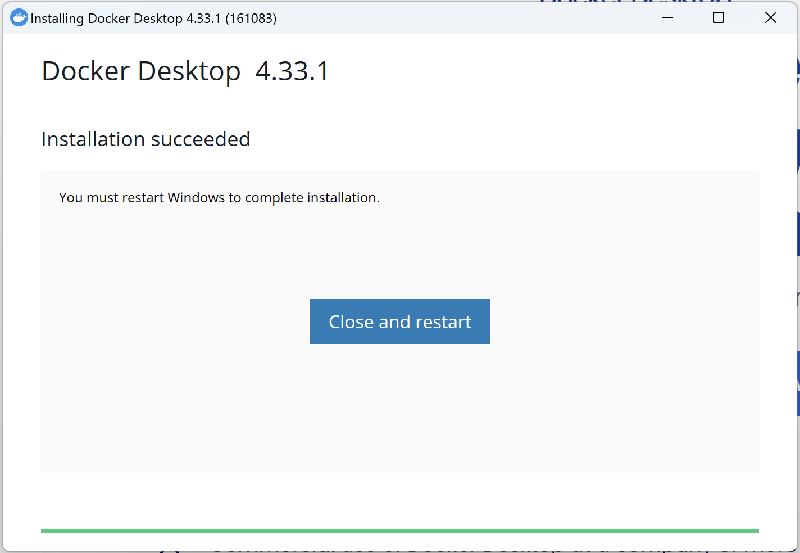
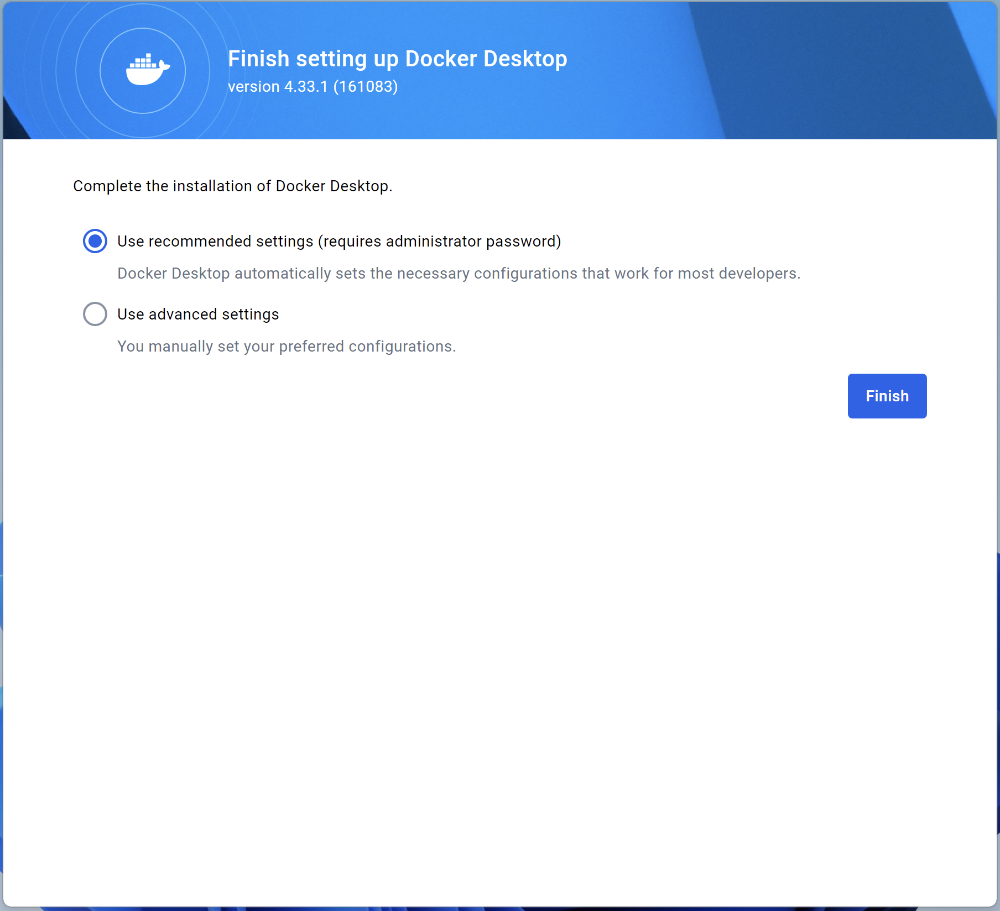

# ROS-Workshop-Fall-2024
The source code for the ROS workshop exercises. 

## Credit

Thank you to Dr. John Paul Ore for providing the basis of these workshops from his ECE 591 Software for Robotics Class. The code and exercises herein have been amended to support ROS2 Humble and add some extra, relevant instruction for club members.x

### Pre-Requisite Software
Before the workshop, please download the following based on your operating system. If you do not have a chance to download the software or are having issues, then we will have time at the beginning to get everything installed. We are just trying to help get the workshop started more efficiently by having these already installed for as many students as possible.

Windows

Install Docker Desktop for your architecture (if you don't know, then probably AMD64/x86): [Docker Desktop](https://www.docker.com/products/docker-desktop/). Follow the installation instructions as shown below 

Now you should be able to open "Command Prompt" and run `docker`. If it outputs a bunch of information about the available docker options, then that means Docker was properly installed. We can make use of both the CLI and the GUI tools during this workshop. 

Next, install [GitHub Desktop](https://desktop.github.com/download/) to download the workshop code onto your local machine. After it installs, choose "Sign into GitHub.com" option on the startup screen. 

MacOS

Install Docker Desktop for your architecture (click the  logo in the upper leftmost corner of the screen and click "About this Mac" if you are unsure of which you have): [Docker Desktop](https://www.docker.com/products/docker-desktop/)

There are various options for git installation, but the Apple XCode installer takes a very long time and installs many other packages besides git. Therefore, [GitHub Desktop](https://desktop.github.com/download/) will work for this workshop and is likely the easier solution. After installation, sign into whichever GitHub account you want to use with the club.

