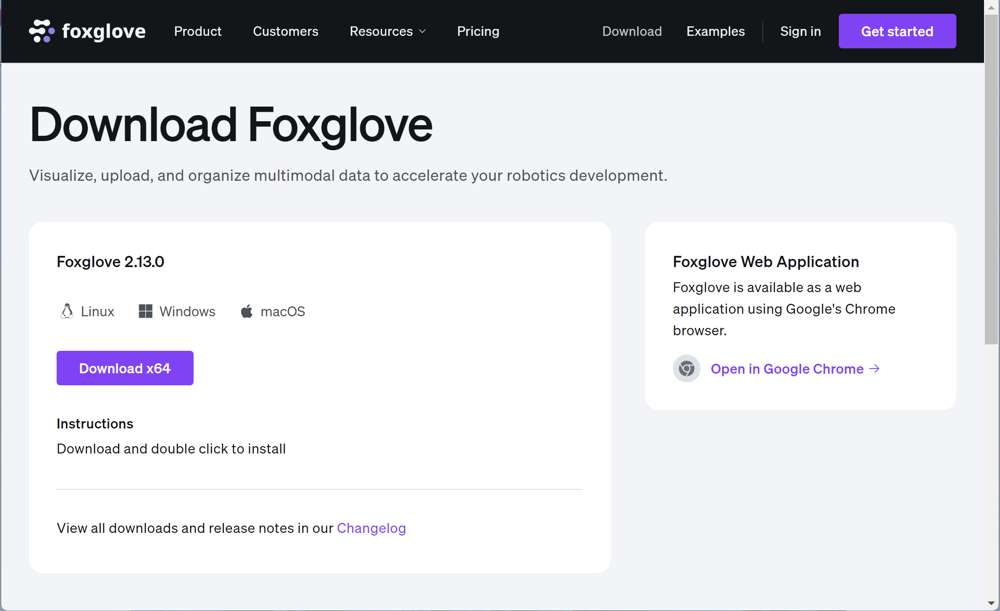
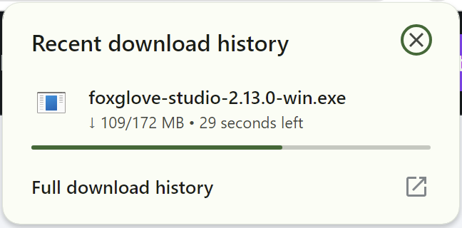
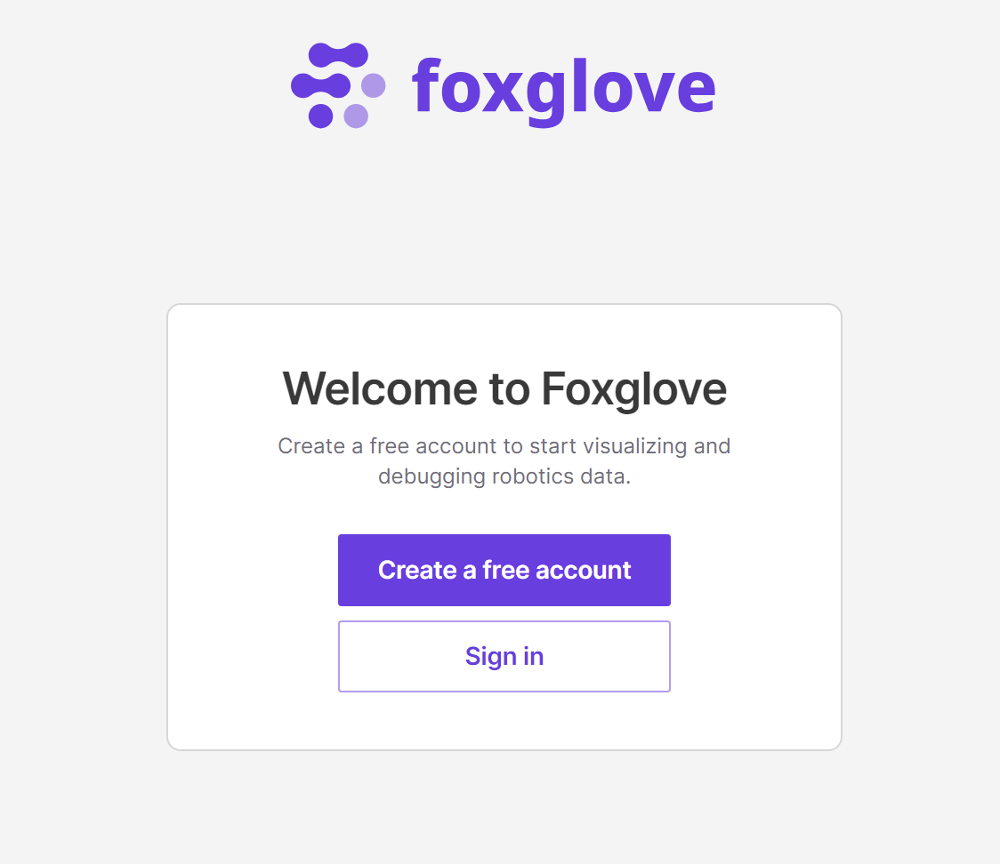
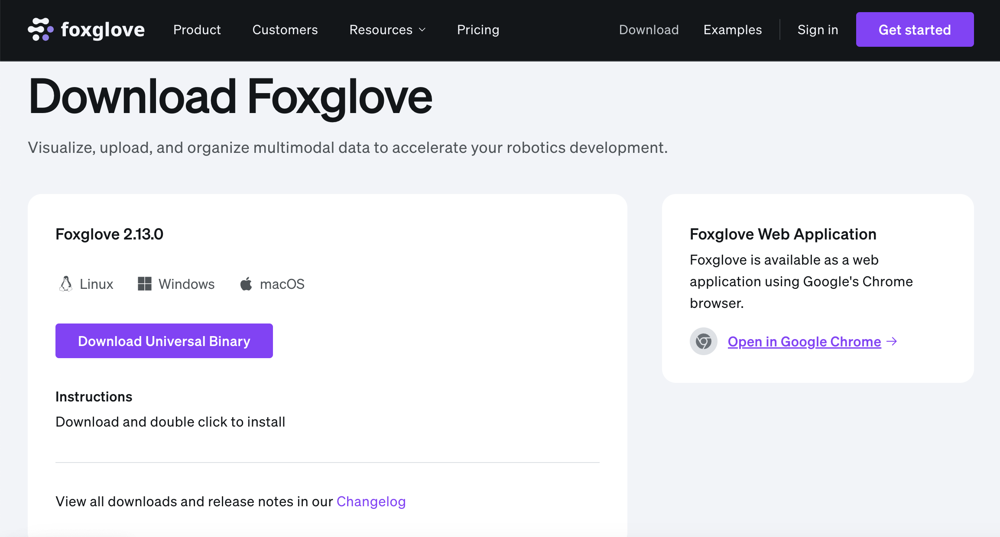
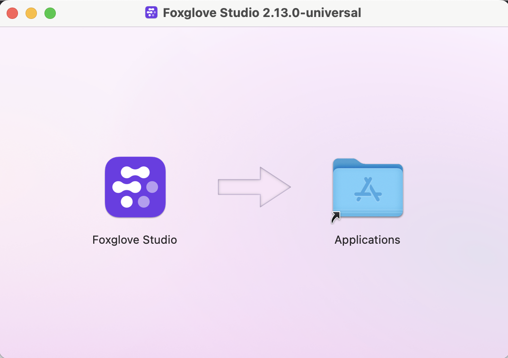
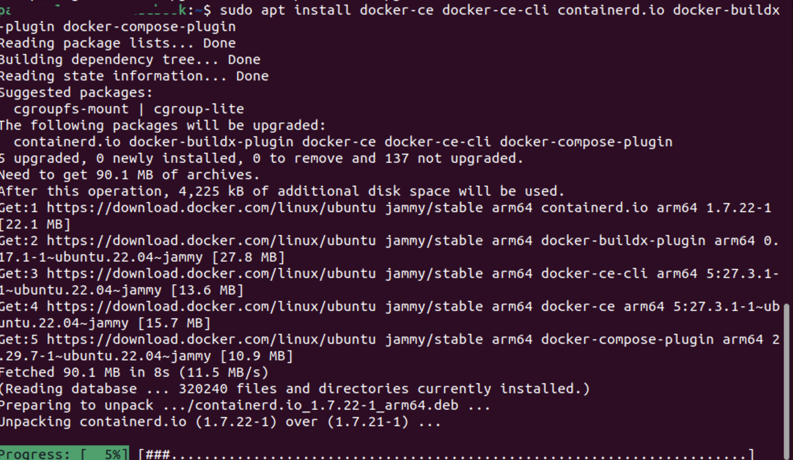
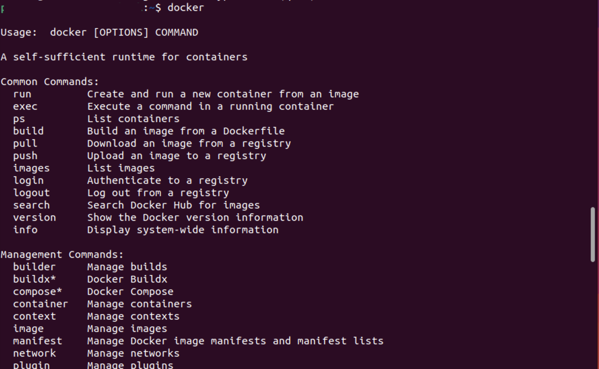
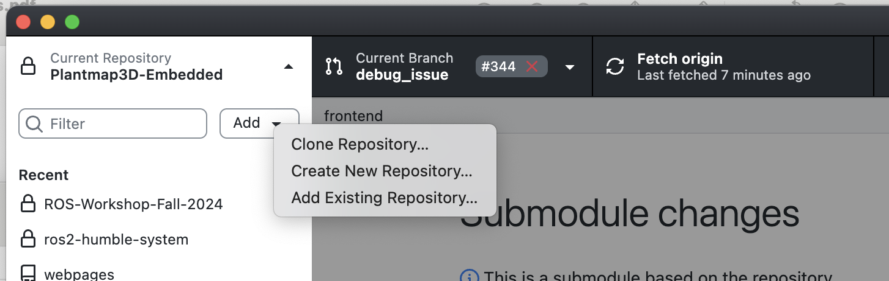
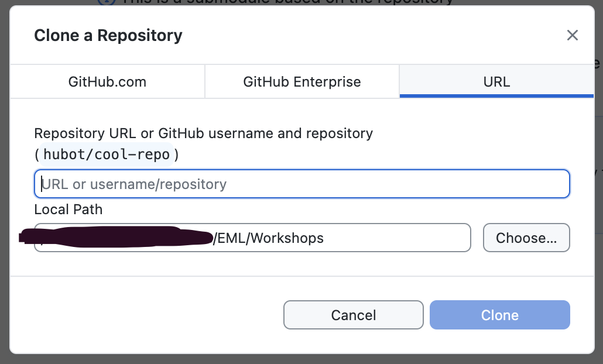

# ROS-Workshop-Fall-2024
The source code for the ROS workshop exercises.

## Credit

Thank you to Dr. John Paul Ore for providing the bulk content of these workshops from his CSC/ECE 591 Software for Robotics Course. The code and exercises herein have been amended to support ROS2 Humble and add some extra, relevant instruction for club members.

### Pre-Requisite Software

Before the workshop, please download the following based on your operating system. If you do not have a chance to download the software or are having issues, then we will have time at the beginning to get everything installed. We are just trying to help get the workshop started more efficiently by having these already installed for as many students as possible.

#### Docker

Docker is a containerization software. It allows the workshops to include a file to specify the exact requirements of the workshop code and create an isolated environment to run the code. Once Docker is installed, it should eliminate most, or hopefully all, issues due to differences in student machines by providing a uniform environment regardless of host software.

#### GitHub

GitHub is a way to share codebases and version history managed by git. This workshop is hosted on GitHub, so we will be using git to "clone" the workshop code to your local machine.

#### Foxglove

Foxglove is a tool for visualizing live systems running ROS. With this tool, you can connect to a ROS system, vizualize various types of data stream, and also inject some data into the system as well. Towards the end of today's workshop, we will be exploring the uses of this software. There is a browser-based version, but we will be installing it locally to prevent issues with networking configurations.

<details>

<summary>Windows</summary>

#### Docker

Install Docker Desktop for your architecture (if you don't know, then probably AMD64/x86): [Docker Desktop](https://www.docker.com/products/docker-desktop/). Follow the installation instructions as shown below 


Now you should be able to open "Command Prompt" and run `docker`. If it outputs a bunch of information about the available docker options, then that means Docker was properly installed. We can make use of both the CLI and the GUI tools during this workshop.

#### GitHub

Next, install [GitHub Desktop](https://desktop.github.com/download/) to download the workshop code onto your local machine. After it installs, choose "Sign into GitHub.com" option on the startup screen.


#### Foxglove

Download Foxglove [here](https://foxglove.dev/download) for Windows and follow the instructions.





Next, create a free account with whichever email you want.



</details>
<details>
<summary>MacOS</summary>

#### Docker

Install Docker Desktop for your architecture (click the  logo in the upper leftmost corner of the screen and click "About this Mac" if you are unsure of which you have): [Docker Desktop](https://www.docker.com/products/docker-desktop/)

#### GitHub

There are various options for git installation, but the Apple XCode installer takes a very long time and installs many other packages besides git. Therefore, [GitHub Desktop](https://desktop.github.com/download/) will work for this workshop and is likely the easier solution. After installation, sign into whichever GitHub account you want to use with the club.

#### Foxglove

Download the universal binary for MacOS [here](https://foxglove.dev/download).



Double-click the downloaded .dmg file and drag the Foxglove icon to Applications.



If prompted, create a free account with whichever email you prefer.

</details>
<details>
<summary>Ubuntu</summary>

#### Docker 

Setup apt repository 

```
# Add Docker's official GPG key:
sudo apt update
sudo apt install ca-certificates curl
sudo install -m 0755 -d /etc/apt/keyrings
sudo curl -fsSL https://download.docker.com/linux/ubuntu/gpg -o /etc/apt/keyrings/docker.asc
sudo chmod a+r /etc/apt/keyrings/docker.asc

# Add the repository to Apt sources:
echo \
  "deb [arch=$(dpkg --print-architecture) signed-by=/etc/apt/keyrings/docker.asc] https://download.docker.com/linux/ubuntu \
  $(. /etc/os-release && echo "$VERSION_CODENAME") stable" | \
  sudo tee /etc/apt/sources.list.d/docker.list > /dev/null
sudo apt update
```

Install necessary Docker packages

```
sudo apt install docker-ce docker-ce-cli containerd.io docker-buildx-plugin docker-compose-plugin
```



Verify that it outputs Docker installation information by typing `docker`.



#### GitHub

The repo will be made public during the workshop, so the only setup that should be required is to install git

```
sudo apt install git
```

#### Foxglove

Follow the instructions for downloading Foxglove Studio [here](https://foxglove.dev/download).

</details>

### Download Local Copy of Workshop Material

If you installed the GitHub Desktop application in the steps above, then you can click the add drop-down menu, select clone..., and copy `https://github.com/embedml/ROS-Workshop-Fall-2024.git` in the URL dialog box.





Finally, click the clone button, and the workshop materials should download to the folder you selected as the "Local Path".

For the UNIX command line, navigate to a folder where you want to store the workshop materials, perhaps `cd ~/Downloads` and run

```
git clone https://github.com/embedml/ROS-Workshop-Fall-2024.git
```

### Extra but Useful Software

#### Visual Studio Code

The workshop exercises are designed to work fine with built-in text editors and the tools downloaded above. If you want a more helpful development environment during the workshop, then [Visual Studio Code](https://code.visualstudio.com/download) is a powerful development environment with extensions to support dozens of languages, as well as specialized extensions for [git](https://marketplace.visualstudio.com/items?itemName=eamodio.gitlens), [docker](https://marketplace.visualstudio.com/items?itemName=ms-azuretools.vscode-docker), [ROS1/2](https://marketplace.visualstudio.com/items?itemName=ms-iot.vscode-ros), and more platforms. (Note that these platform extensions are not expected to be used during this workshop, but the VS Code recommended language support extensions for [C++](https://marketplace.visualstudio.com/items?itemName=ms-vscode.cpptools) and [Python](https://marketplace.visualstudio.com/items?itemName=ms-python.python) are helpful if you want to use VS Code during the workshop exercises.)
